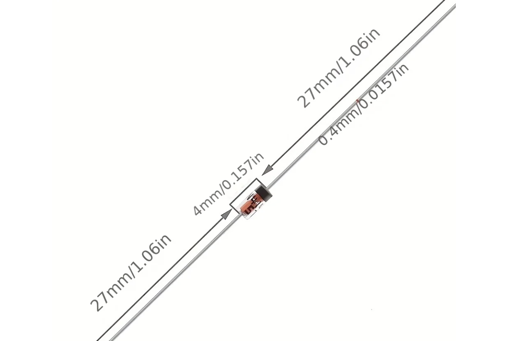
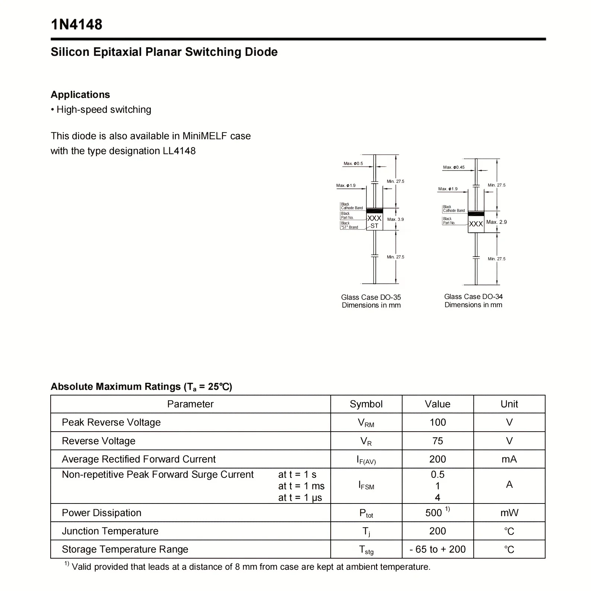
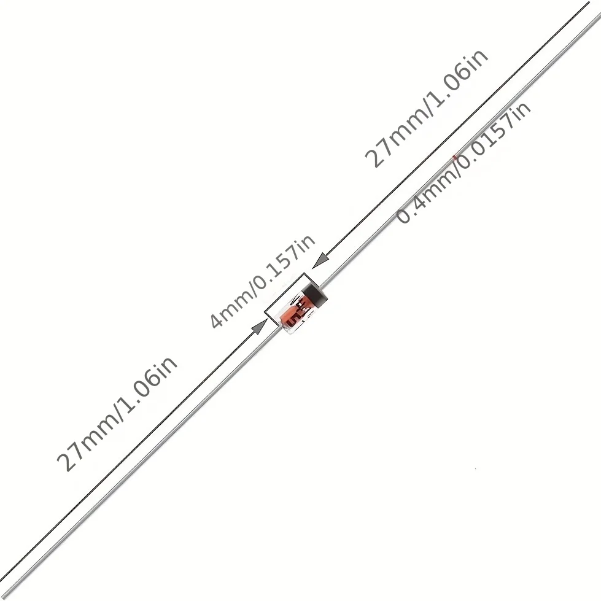

# 1N4148 다이오드 (keypad 매트릭스용)

> keypad·**65** PCB의 매트릭스 다이오드. 사용자가 직접 손납땜한다. (65 적용 사양: `65/docs/pcb-build.md` §1) 기존 SMD(`D_SOD-123`)를 제거하고 이 **THT(DO-35)** 부품을 꽂아 납땜할 수 있는 구멍으로 교체했다(PCB·스키마틱 양쪽 반영).

## 부품

- **1N4148** — Silicon Epitaxial Planar Switching Diode (high-speed switching).
- 패키지: **Glass Case DO-35** (축형 through-hole).
- KiCad 풋프린트: `Diode_THT:D_DO-35_SOD27_P7.62mm_Horizontal` (수평, 리드 피치 7.62mm).
- 값(value): `1N4148`.

## 치수 (DO-35)

| 항목        | 값                                    |
| ----------- | ------------------------------------- |
| 바디 지름   | Max Ø1.9 mm                           |
| 바디 길이   | Max 3.9 mm                            |
| 리드 지름   | Max Ø0.5 mm (실물 ≈Ø0.4)              |
| 리드 길이   | Min 27.5 mm (양측, 구매품 실측 27 mm) |
| 캐소드 표시 | 검정 띠(black cathode band)           |

## 전기 사양 (Ta = 25 °C)

| 항목                          | 기호    | 값            |
| ----------------------------- | ------- | ------------- |
| Peak Reverse Voltage          | V_RM    | 100 V         |
| Reverse Voltage               | V_R     | 75 V          |
| Avg Rectified Forward Current | I_F(AV) | 200 mA        |
| Power Dissipation             | P_tot   | 500 mW        |
| Junction Temperature          | T_j     | 200 °C        |
| Storage Temp                  | T_stg   | −65 ~ +200 °C |

## 키보드 매트릭스 적용

- 극성: anode(스위치측, net `Net-Dx-A`) → cathode(`K` 표시, net `ROWx`). DO-35 풋프린트 pad1 = cathode, pad2 = anode.
- `keypad/pcb`의 PCB(`keyboard.kicad_pcb`)·스키마틱(`keyboard.kicad_sch`) 모두 footprint=DO-35, value=1N4148로 일치.

## 구매품 축형 치수 (2026-07-07, 판매 이미지)

바디 4 mm · 리드 각 **27 mm × Ø0.4 mm** — 드릴 Ø0.8 대비 여유 2배.

## 사진 (레퍼런스)

_데이터시트 — DO-35/DO-34 케이스 도면 + Absolute Maximum Ratings._

_실물 — 바디 4mm, 리드 Ø0.4 · 27mm (DO-35 형태)._
